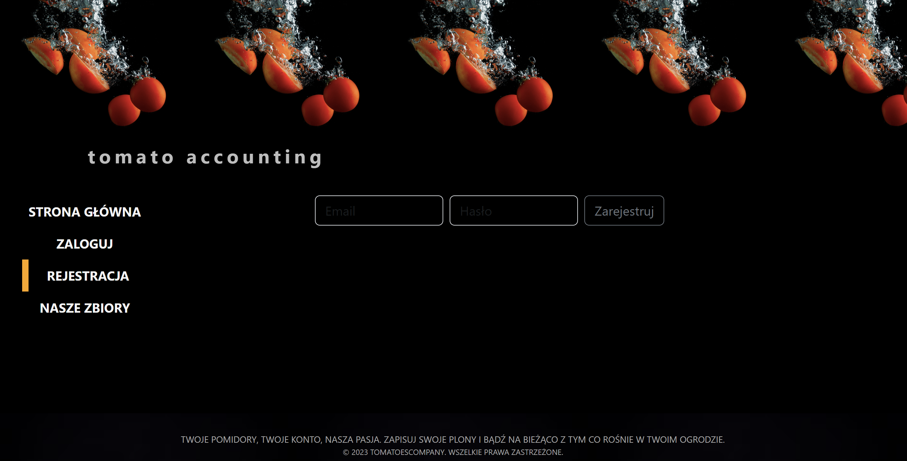

# TomatoAccounting
## Overview
* [About](#general-info)
* [Technologies](#technologies)
* [Setup](#setup)
* [How it works](#how-it-works)

## About

This is a very simple application for saving tomato harvests during the season.
Thanks to it, I know how many tomatoes were collected from each strain.
This helps in making decisions regarding the choice of varieties for the next season.


## Technologies
* Java 17
* Spring Boot 2.7
* Maven
* MySQL
* Lombok
* Security
* Docker

## Setup

make folder tomatoAccounting when you want to run application locally, entry inside folder and run command:
```git clone
git clone https://github.com/PiotrSchodowski/tomatoAccounting-backend.git
git clone https://github.com/PiotrSchodowski/tomatoAccounting-frontend.git
```
entry inside backend folder, copy docker-compose.yaml and paste to tomatoAccounting folder, run command:
```docker-compose-up```
 
then open ```localhost:3000``` in your browser


## How it works
1. Create account

2. Login

3. Create strains


4. Add harvests in kg per strain


5. Check the harvests, and now you can make decisions about the next season, determining which strain will be better for sale. ;)


